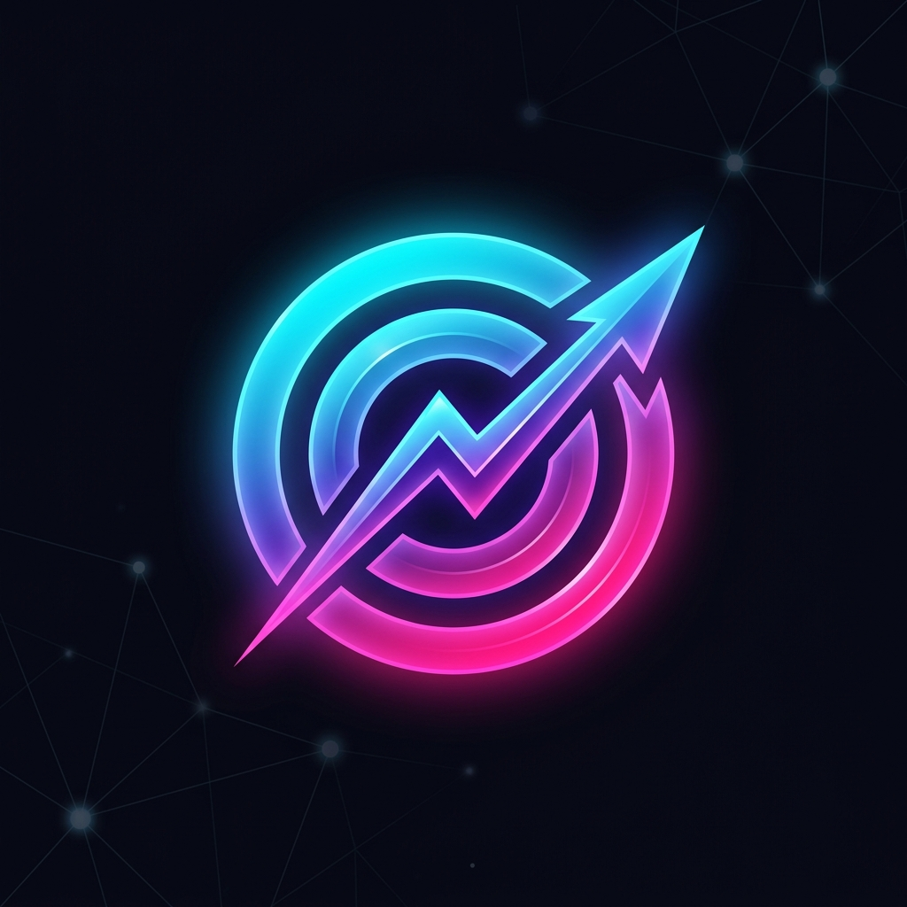

<div align="center">
  
  
  # OmniPredict
  
  **The ultimate decentralized prediction market for the Flare Network.** <br/>
  *Frictionless onboarding. Instant resolution. Professional data density.*

  <br />

  [](https://reactjs.org/)
  [](https://flare.network/)
  [](https://privy.io/)
  [](https://www.typescriptlang.org/)

</div>

---

## 🌍 The Vision

Current prediction markets are either overly complex Web3 labyrinths that alienate mainstream users, or they rely on centralized Oracles that can be easily manipulated. 

**OmniPredict** solves both of these problems. Built exclusively on the **Flare Network**, OmniPredict combines a hyper-optimized, Polymarket-style professional UI with the mathematical security of Flare's **FTSO (Flare Time Series Oracle)** and **FDC (Flare Data Connector)**. 

Whether you are hedging against high-frequency crypto volatility or speculating on localized African weather patterns, OmniPredict offers a seamless, zero-friction Web2 experience powered by bulletproof Web3 infrastructure.

---

## ✨ Core Features

### 1. Frictionless 1-Click UX
No seed phrases. No gas confusion. No ERC-20 `approve()` nightmares. 
By integrating **Privy Embedded Wallets** and leveraging **native FLR** for betting, users can sign in with a simple Google account and start trading with 1-click execution.

### 2. High-Density Professional Dashboard
OmniPredict features a heavily customized, data-dense UI built for serious traders. 
- Side-by-side execution buttons for rapid betting.
- A live **Order Book / Activity Feed** simulating real-time volume.
- Institutional color palette (Trustworthy Blue/Navy) for a premium feel.

### 3. Permissionless Market Creation
Anyone can be a market maker. Users can pay a **10 FLR anti-spam creation fee** to deploy their own custom markets directly to the blockchain via our intuitive "Launch Market" UI. 

### 4. OmniAI: The Quantitative Scanner
A premium, built-in AI assistant powered by the lightning-fast **Groq API**. OmniAI acts as an advanced quantitative analyst, synthesizing FTSO data trends and Web2 macro data to give users high-probability trading recommendations and risk analysis.

---

## 🏗️ Technical Architecture

OmniPredict is built on a modern, highly scalable stack:

- **Frontend:** React + Vite + TypeScript.
- **Styling:** Custom CSS implementing a highly-responsive CSS Grid layout.
- **Web3 Auth:** Privy (Email/Social Login -> Embedded C2FLR Wallet).
- **Blockchain:** Flare Coston2 Testnet.
- **Smart Contracts:** Solidity (Hardhat) utilizing `msg.value` for optimized native routing.
- **AI Core:** Vercel Serverless Functions + Groq API (LLaMA 3).

### The Smart Contract (`OmniPredictMarket.sol`)
The core contract handles everything from market creation to Pari-Mutuel odds calculation and payout distribution. 
- **FTSO Integration:** Crypto markets are resolved trustlessly by fetching the exact final price from the FTSO Registry at the expiration timestamp.
- **FDC Ready:** Weather and Political markets are structured to accept trustless Web2 API data proofs via the Flare Data Connector.

---

## 💻 Running Locally

Ready to deploy your own instance of OmniPredict?

### 1. Clone & Install
```bash
git clone https://github.com/your-username/OmniPredict.git
cd OmniPredict
npm install
```

### 2. Environment Setup
Create a `.env` file in the root directory:
```env
# Frontend Config
VITE_PRIVY_APP_ID=your_privy_app_id
VITE_MARKET_CONTRACT_ADDRESS=0x07E99fC3c01E57741bbd9BEA1a34faD9EFc458b8

# Backend AI Config (Groq API)
GROQ_API_KEY=your_groq_api_key

# Smart Contract Deployment (Optional)
PRIVATE_KEY=your_deployer_private_key
```

### 3. Start the Development Server
```bash
npm run dev
```

### 4. (Optional) Deploying the Smart Contract
If you want to deploy a fresh instance of the market contract to Coston2:
```bash
npx hardhat ignition deploy ignition/modules/OmniPredict.ts --network coston2 --reset
npx hardhat run scripts/seed.ts --network coston2
```

---

## 🏆 Hackathon Submission Details
**Track:** Flare Network 
**Bounties Targeted:** Best DeFi / Prediction Market, Best integration of FTSO/FDC.

*Built with ❤️ for the Flare Network Hackathon 2026*
